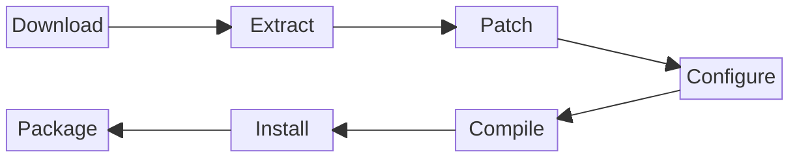

# Build Workflow

This page explains how spksrc builds work, from source code to installable SPK.

## Build Process Overview



### Build Stages

| Stage | Description | Make Target |
|-------|-------------|-------------|
| Download | Fetch source archive | `download` |
| Checksum | Verify file integrity | `checksum` |
| Extract | Unpack source archive | `extract` |
| Patch | Apply patches | `patch` |
| Configure | Run configure script | `configure` |
| Compile | Build the software | `compile` |
| Install | Install to staging | `install` |
| Package | Create SPK file | `package` |

## Basic Commands

### Discovering targets (`make help`)

`make help` is context-aware — run it wherever you are:

```bash
# At the spksrc root: repository-wide orchestration targets
make help
make help-clean          # filter the list by section or name

# Inside a package: the targets relevant to that package
make -C spk/transmission help
make -C cross/curl help
```

At the root it lists the orchestration targets (`setup`, `all`, `clean`,
digests, lint, …) grouped by section; `make help-<topic>` filters them.
Inside a package (`cross/`, `spk/`, `native/`, `toolchain/`, `toolkit/`,
`kernel/`, `diyspk/`) it lists that package's build lifecycle, the multi-arch
targets (`all-supported`, `arch-<arch>-<tcvers>`, …), the inspection and
maintenance targets, and — for Python SPKs — the wheel/crossenv targets. Only
documented targets are shown, so the internal `pre_*` / `post_*` / `*_msg`
hooks stay hidden.

### Build a Package

```bash
# Build for specific architecture (required)
make -C spk/transmission ARCH=x64 TCVERSION=7.2

# Build for ARM 64-bit
make -C spk/transmission ARCH=aarch64 TCVERSION=7.2

# Build for all supported architectures (uses DEFAULT_TC from local.mk)
make -C spk/transmission all-supported
```

### Clean Builds

```bash
# Clean build artifacts (keeps downloads)
make -C spk/transmission clean
```

### Debug Builds

```bash
# Show what would be built
make -C spk/transmission -n ARCH=x64 TCVERSION=7.2

# Verbose output
make -C spk/transmission V=1 ARCH=x64 TCVERSION=7.2

# Build single stage
make -C spk/transmission configure ARCH=x64 TCVERSION=7.2
make -C spk/transmission compile ARCH=x64 TCVERSION=7.2
```

## Specifying Targets

### Architecture and DSM Version

```bash
# Intel 64-bit, DSM 7.2
make ARCH=x64 TCVERSION=7.2

# ARM 64-bit, DSM 7.2
make ARCH=aarch64 TCVERSION=7.2

# Using arch-* targets
make arch-x64-7.2
make arch-aarch64-7.2
```

### Common Architectures

| ARCH | TCVERSION | Description |
|------|-----------|-------------|
| `x64` | `7.2` | Intel 64-bit (DS923+, etc.) |
| `aarch64` | `7.2` | ARM 64-bit (DS220+, DS720+) |
| `armv8` | `7.2` | ARM 64-bit Realtek (DS223) |
| `x64` | `6.2` | Intel 64-bit, DSM 6.2 |

## Dependency Handling

spksrc automatically builds dependencies:

```makefile
# In spk/transmission/Makefile
DEPENDS = cross/transmission cross/curl
```

When you build `spk/transmission`:

1. spksrc checks if `cross/transmission` is built
2. If not, it builds `cross/transmission` first
3. `cross/transmission` depends on `cross/curl`, `cross/openssl`, etc.
4. Dependencies are built recursively

### Force Rebuild Dependencies

```bash
# Rebuild a specific dependency
make -C cross/curl clean
make -C cross/curl ARCH=x64 TCVERSION=7.2

# Then rebuild the SPK
make -C spk/transmission ARCH=x64 TCVERSION=7.2
```

## Local Configuration

### local.mk

Create `local.mk` in the repository root (run `make setup` or copy from `local.mk.sample`):

```makefile
# Default toolchain versions to build for (used by all-supported target)
DEFAULT_TC = 6.2.4 7.1

# Parallel builds
PARALLEL_MAKE = max

# Custom download cache location
DISTRIB_DIR = /path/to/cache
```

### Environment Variables

```bash
# Verbose output
export V=1

# Use a proxy
export http_proxy="http://proxy:3128"
export https_proxy="http://proxy:3128"
```

## Build Artifacts

### Work Directory

Each package has a work directory per architecture:

```
cross/curl/work-x64-7.2/
├── curl-8.4.0/          # Extracted source
├── install/             # Compiled files
└── staging/             # Files for SPK packaging
```

### Output

Built SPK files are placed in `packages/`:

```
packages/
├── transmission_x64-7.2_4.0.5-1.spk
├── transmission_aarch64-7.2_4.0.5-1.spk
└── transmission_armv8-7.2_4.0.5-1.spk
```

### Download Cache

Source files are cached in `distrib/`:

```
distrib/
├── transmission-4.0.5.tar.xz
├── curl-8.4.0.tar.xz
└── ...
```

## Debugging Build Issues

### View Build Logs

You do not need to pipe anything: every build already writes a log. The build
output you see on screen is teed to a log file at the same time, so there is
always a file to go back to after a failure.

**Logs land in the directory you started the build from.** That directory is the
"initial directory", and *all dependencies aggregate their output into it* — build
`spk/tvheadend` and the cross libraries and native tools it pulls in log there
too, not in their own directories. This is deliberate: one build, one place to
look.

```bash
make -C spk/tvheadend arch-x64-7.2
ls spk/tvheadend/*.log          # everything about that build is here
```

Only the outermost build wraps itself in logging; nested dependency builds are
captured into that same log rather than opening their own.

#### Log file per kind of package

The file name says what was built, and *for what*:

| You build | Log file | Meaning |
|-----------|----------|---------|
| `cross/`, `spk/`, `diyspk/` | `build-<arch>-<tcversion>.log` | built **for** that architecture |
| `toolchain/` | `build-<arch>-<tcversion>.log` | the toolchain for that architecture |
| `kernel/` | `build-<arch>-<kernelversion>.log` | that kernel |
| `native/` | `build-native.log` | a host tool — runs on the **build host** |

Plus `status-build.log` in the same directory: one line per stage with a
timestamp, the parallel-build setting, an `ARCH:` column and the package name —
handy to see what ran, in what order, and what failed.

#### Advanced: a native package that targets an architecture

A few `native/` packages are parametrized by `(arch, DSM version)` — for example
`native/gcc8`, which rebuilds gcc as a cross-compiler for one Synology toolchain,
and its co-built `native/binutils-*`. They get one work directory per target,
`work-<arch>-<tcversion>`, and one log per target:

```
build-native-<arch>-<tcversion>.log     e.g. build-native-avoton-6.2.4.log
```

The `build-native` prefix is what matters here. Such a package still **runs on the
host** — it only *targets* that architecture, it is not built to run on it — so its
log must not be mistaken for a `cross/` log of the same arch. Compare:

```
toolchain/syno-avoton-6.2.4/build-avoton-6.2.4.log         # built FOR avoton
native/gcc8/build-native-avoton-6.2.4.log                  # runs on the host, targets avoton
```

This is an atypical case; a normal `native/` package has no target and stays on
plain `build-native.log`. The `ARCH:` column in `status-build.log` still reports
the target (`avoton-6.2.4`), since that is what identifies the build.

#### Verbose output

```bash
make V=1 ARCH=x64 TCVERSION=7.2
```

### Build Individual Stages

```bash
# Build up to a specific stage
make -C cross/curl extract ARCH=x64 TCVERSION=7.2
make -C cross/curl patch ARCH=x64 TCVERSION=7.2
make -C cross/curl configure ARCH=x64 TCVERSION=7.2
make -C cross/curl compile ARCH=x64 TCVERSION=7.2

# Check the work directory
ls cross/curl/work-x64-7.2/
```

### Inspect the Source

```bash
# After extract stage
cd cross/curl/work-x64-7.2/curl-8.4.0/
ls -la
cat config.log  # If configure failed
```

### Re-run a Failed Stage

```bash
# Remove the stage marker and retry
rm cross/curl/work-x64-7.2/.configure_done
make -C cross/curl configure ARCH=x64 TCVERSION=7.2
```

## Parallel Builds

### Enable Parallel Builds

```makefile
# In local.mk
PARALLEL_MAKE = max
```

### Notes on Parallelism

- Build stages for a single package run in sequence
- Different architectures can build in parallel
- Dependency packages must complete before dependents start
- Some packages have race conditions; disable parallel builds if issues occur

## CI/CD Integration

spksrc uses GitHub Actions for automated builds. See [Publishing](../publishing/index.md) for details on:

- Automatic builds on push
- Building for all architectures
- Publishing to package server

## Next Steps

- **[Packaging Guide](../packaging/index.md)** - Create your own package
- **[Makefile Variables](../packaging/makefile-variables.md)** - Complete variable reference
