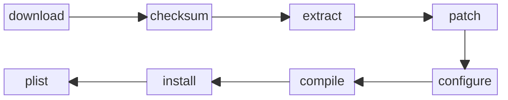
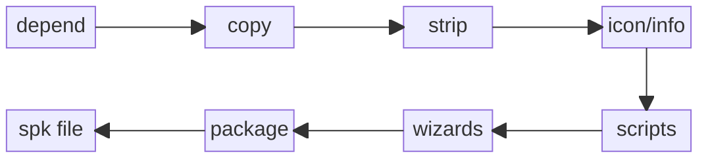

# Build Architecture

This document describes the internal architecture of the spksrc build system, including the build pipeline, stage interactions, and how packages are assembled.

## Build Pipeline Overview

The spksrc build system uses a pipeline-based architecture where each build stage depends on the previous one. The pipeline is implemented through GNU Make with cookie files tracking completion.



## Cross-Compilation Stages

Cross-compilation in spksrc runs in three stages. Stage 0 happens at *parse time*; stages 1 and 2 run as *recipes*.

### Stage 0: Toolchain Pre-bootstrap

At parse time — before a package's `DEPENDS` are evaluated — stage 0 (`mk/spksrc.common/stage0.mk`) bootstraps the toolchain in its own work directory and loads its `tc_vars.mk`, so `TC_GCC` (and `TC_VERS`, `TC_KERNEL`, ...) are known. This lets `version_ge($(TC_GCC),...)`-gated dependencies (shaderc, vulkan, numpy, ...) evaluate against a real compiler version on a cold tree. It records `.stage0-bootstrap_done` and deliberately does **not** generate the package's own `tc_vars*`, which embed `INSTALL_PREFIX`-derived paths only available at recipe time.

### Stage 1: Toolchain Bootstrap

Stage 1 ensures the cross-compilation toolchain is ready:

1. **Toolchain Download** - Fetches the Synology toolchain for the target architecture
2. **Toolchain Extraction** - Unpacks the toolchain to the working directory
3. **tc_vars Generation** - Creates environment files that configure the build:
   - `tc_vars.mk` - Core toolchain identity and paths
   - `tc_vars.autotools.mk` - Autotools adapter variables
   - `tc_vars.flags.mk` - C/C++ compiler flags
   - `tc_vars.rust.mk` - Rust environment (if applicable)
   - `tc_vars.cmake` - CMake toolchain file
   - `tc_vars.meson-*` - Meson cross/native configuration files

Stage 1 runs as a recipe and is the sole generator of the package's `tc_vars*` (those embed `INSTALL_PREFIX`-derived paths from the build environment). For `spk/` packages it also builds the meta sources (`spk-meta-source`). It is idempotent—if the `.stage1-tcvars_done` cookie exists, it's skipped.

### Stage 2: Package Build

Stage 2 builds the actual package using the cross-compilation environment:

1. **depend** - Resolves and builds package dependencies
2. **download** - Fetches source archives
3. **checksum** - Verifies archive integrity
4. **extract** - Unpacks source code
5. **patch** - Applies patches from the `patches/` directory
6. **configure** - Runs configure scripts (autotools, CMake, meson, etc.)
7. **compile** - Compiles the source code
8. **install** - Installs to the staging area
9. **plist** - Generates the package list

### Stage Pipeline

The same three-stage model drives both `cross/` and `spk/` builds (mirrors the diagrams in `mk/spksrc.cross-cc.mk` and `mk/spksrc.spk.mk`):

```text
┌─ stage 0 ── parse time (mk/spksrc.common/stage0.mk) ───────────────┐
│  bootstrap the toolchain in its own work dir, load its tc_vars.mk  │
│  → TC_GCC known, so version_ge($(TC_GCC),...) DEPENDS parse right  │
│  cookie: .stage0-bootstrap_done   (does NOT write package tc_vars) │
└────────────────────────────────────────────────────────────────────┘
                              │  (recipes run after parse)
┌─ stage 1 ── recipe time (cross-cc.mk / spk.mk) ────────────────────┐
│  make -C toolchain/<TC> toolchain    (MANDATORY)                   │
│  make -C toolchain/<TC> toolkit      (OPTIONAL, REQUIRE_TOOLKIT)   │
│  generate the package work-dir tc_vars* (needs INSTALL_PREFIX)     │
│  [spk only] spk-meta-source: build the meta sources                │
│  cookies: .stage1-tcvars_done / .stage1-tkvars_done   (idempotent) │
└────────────────────────────────────────────────────────────────────┘
                              │
┌─ stage 2 ── recipe time ───────────────────────────────────────────┐
│  cross: download → extract → patch → configure → compile →         │
│         install → plist                                            │
│  spk:   depend → copy → strip → icon → wizards → package           │
└────────────────────────────────────────────────────────────────────┘
```

## SPK Package Assembly

For `spk/` packages, additional stages create the final SPK:



### SPK Assembly Steps

1. **depend** - Builds all dependencies listed in `DEPENDS`
2. **copy** - Copies dependency outputs to staging
3. **strip** - Strips debug symbols from binaries
4. **icon/info** - Processes icons and generates INFO file
5. **scripts** - Generates install/upgrade scripts from templates
6. **wizards** - Processes wizard templates (mustache format)
7. **package** - Creates `package.tgz` from staging area
8. **spk** - Assembles final `.spk` file

## Work Directory Structure

Each package build creates a work directory with consistent structure:

```
work-<arch>-<tcversion>/
├── <package>-<version>/     # Extracted source code
├── install/                  # Staging area for installation
│   └── var/packages/<pkg>/
│       └── target/           # Final package files
├── staging/                  # SPK assembly area
│   ├── package.tgz
│   ├── INFO
│   ├── scripts/
│   └── conf/
├── tc_vars.mk                # Toolchain variables
├── tc_vars.*.mk              # Build system adapters
└── .<stage>_done             # Cookie files
```

## Dependency Resolution

spksrc handles three types of dependencies:

### Build Dependencies (`DEPENDS`)

Listed in the Makefile, these are built before the current package:

```makefile
DEPENDS = cross/openssl3 cross/zlib
```

The framework recursively builds each dependency, installs it to the staging area, and makes it available to subsequent builds.

### Native Dependencies (`NATIVE_DEPENDS`)

Tools needed on the build host (not cross-compiled):

```makefile
NATIVE_DEPENDS = native/cmake
```

### Python Dependencies

Python packages use the wheel system for cross-compilation:

```makefile
WHEELS = src/requirements.txt
```

### Meta Package Dependencies

Large shared libraries are provided by *meta packages* — `ffmpeg7`, `python312`,
and `synocli-videodriver` — that a consumer reuses instead of rebuilding. The
meta to use is selected by a single variable:

```makefile
FFMPEG_PACKAGE   = ffmpeg7              # e.g. spk/tvheadend
PYTHON_PACKAGE   = python312            # any wheel consumer
VIDEODRV_PACKAGE = synocli-videodriver

include ../../mk/spksrc.spk-meta.mk
```

A consumer includes `mk/spksrc.spk-meta.mk` (not the per-meta files directly); based on which `*_PACKAGE` variables are set, `spk-meta.mk` pulls in the matching `spksrc.spk-meta/{python,ffmpeg,videodriver}.mk` (then `spksrc.spk.mk`). That builds the meta source in stage 1 and, during SPK assembly (stage 2), wires its staging area into the consumer's build through `SPK_BASE_TEMPLATE`:

- **`PKG_CONFIG_LIBDIR` (ordered)** — the consumer's own staging first, then each
  meta's `lib/pkgconfig` (`META_PKG_CONFIG_LIBDIR`). pkg-config takes the first
  match, so a local copy always wins over the meta's. The same ordered path is
  shared by autotools, meson, and the cmake toolchain file.
- **`OPENSSL_STAGING_INSTALL_PREFIX` / `OPENSSL_ROOT_DIR`** — a single OpenSSL
  prefix derived from that ordered path (cmake's `find_package(OpenSSL)` ignores
  pkg-config, so the prefix is baked into the toolchain file).
- **`CMAKE_FIND_ROOT_PATH`** — includes the meta staging roots so cmake's
  `find_package` / `find_path` / `find_library` locate meta-provided headers and
  libraries (e.g. FFmpeg, EXPAT) without per-package hints.

Because the meta's `lib/pkgconfig` is on `PKG_CONFIG_LIBDIR` directly, a consumer
needs neither per-`.pc` symlinks nor per-package `-DOPENSSL_*` / `-DEXPAT_*` /
`-DFFMPEG_*` hints: the meta's libraries are resolved centrally.

## Environment Configuration

The build environment is configured through layered includes:

1. **spksrc.common.mk** - Base settings and utilities
2. **spksrc.cross/env-default.mk** - Cross-compilation environment
3. **tc_vars.mk** - Toolchain-specific variables
4. **Build system specific** - CMake, meson, autotools adapters

### Environment Variables

The framework exports numerous variables to configure cross-compilation:

| Variable | Purpose |
|----------|--------|
| `CC`, `CXX` | Cross-compiler paths |
| `CFLAGS`, `CXXFLAGS` | Compiler flags |
| `LDFLAGS` | Linker flags |
| `PKG_CONFIG_LIBDIR` | Ordered pkg-config search path (local staging, then meta staging) |
| `META_PKG_CONFIG_LIBDIR` | Meta packages' `lib/pkgconfig` dirs, exported to `cross/` sub-makes |
| `OPENSSL_STAGING_INSTALL_PREFIX` | Single OpenSSL prefix shared by autotools and cmake |
| `STAGING_INSTALL_PREFIX` | Installation prefix |

### Toolchain Variable Files (`tc_vars*`)

The toolchain bootstrap (stage 1; the toolchain-dir `tc_vars.mk` also at stage 0) generates a set of `tc_vars*` files. `cross-env.mk` loads a subset of them into the make environment, selected by `DEFAULT_ENV` (default `autotools flags rust`):

| File | Contents | Loaded into the make env |
|------|----------|--------------------------|
| `tc_vars.mk` | Toolchain identity and paths (`TC`, `TC_PATH`, `CC`, `CXX`, `TC_GCC`, ...) | **always** |
| `tc_vars.flags.mk` | C / C++ / CPP / LD compiler & linker flags | autotools |
| `tc_vars.autotools.mk` | Autotools (`configure`) environment | autotools |
| `tc_vars.rust.mk` | Rust / Cargo environment | autotools |
| `tc_vars.cmake` | CMake toolchain file — read by `cmake`, not a `.mk` | — |
| `tc_vars.meson-cross`, `tc_vars.meson-native` | Meson cross/native files — read by `meson` | — |

**Clean environment for CMake and Meson.** CMake (`DEFAULT_ENV = cmake`) and Meson (`DEFAULT_ENV = meson`) deliberately load **only `tc_vars.mk`** into the make environment — there is no `tc_vars.cmake.mk` or `tc_vars.meson.mk` to pick up. All compiler/linker/rust flags are instead *baked into* the CMake toolchain file (`tc_vars.cmake`) and the Meson cross file (`tc_vars.meson-cross`), each generated by a sub-make run with `DEFAULT_ENV="flags rust"`. CMake and Meson then read those files directly, so the build runs in a pristine, fully-controlled environment that does not inherit stray flags from the shell. Autotools, by contrast, receives the same flags through the environment (`tc_vars.flags.mk` + `tc_vars.autotools.mk` + `tc_vars.rust.mk`).

## Parallel Build Support

spksrc supports parallel builds with three modes:

| Mode | Description |
|------|------------|
| `nop` | No parallel build (single job) |
| `max` | Use all available CPUs |
| `N` | Use exactly N parallel jobs |

Configure in `local.mk`:

```makefile
PARALLEL_MAKE = max
```

Or disable per-package:

```makefile
DISABLE_PARALLEL_MAKE = 1
```

## Build Logging

Build output is logged to:

- `build-<arch>-<tcversion>.log` - Main build log
- `status-<arch>-<tcversion>.log` - Status messages

The `MSG` macro provides consistent message formatting:

```makefile
@$(MSG) "Compiling $(NAME)"
```

## Related Documentation

- [Makefile System](makefile-system.md) - Detailed mk/*.mk documentation
- [Toolchains](toolchain.md) - Toolchain management details
- [Developer Guide: Build Workflow](../developer-guide/basics/build-workflow.md) - Using make targets
