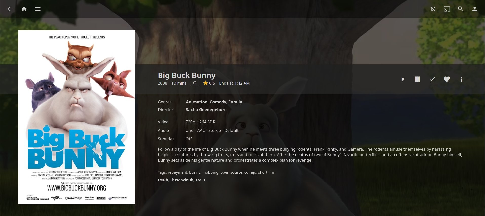

# Jellyfin

Jellyfin is a free software media system that puts you in control of managing and streaming your media.

## Package Information

| Property | Value |
|----------|-------|
| Package Name | jellyfin |
| Upstream | [jellyfin.org](https://jellyfin.org/) |
| License | GPL-2.0 |
| Default Port | 8096 |

## Installation

1. Install Jellyfin from Package Center
2. Access web interface at `http://your-nas:8096`
3. Complete initial setup wizard

## Configuration

### Data Location

- Configuration: `/var/packages/jellyfin/var/config/`
- Cache: `/var/packages/jellyfin/var/cache/`
- Log: `/var/packages/jellyfin/var/log/`

### Hardware Transcoding

For Intel-based Synology devices:

1. Install [SynoCli Video Driver](synocli-videodriver.md) package
2. Enable hardware acceleration in Jellyfin Dashboard → Playback → Transcoding
3. Select "Video Acceleration API (VAAPI)" as the hardware acceleration method
4. Set the VA-API device to `/dev/dri/renderD128`

## Major Upgrades and Rollback

Major Jellyfin versions migrate the database forward with no downgrade
path: an older server cannot read a migrated database. When you upgrade
across major versions, the package automatically takes a backup
beforehand (`jellyfin_backup_v<previous-version>_YYYYMMDD.tar.gz`),
which is what makes a rollback possible.

### What the backup contains

Everything needed to restore your server: configuration, the library
database, users, metadata, artwork, playlists, and Jellyfin's own
scheduled backups. Skipped on purpose is bulk the server transparently
regenerates: prior rollback archives, transcode segments, and the
extracted subtitle/attachment caches.

### How to roll back

1. In Package Center, uninstall Jellyfin and choose **Restore backup of
   the package data files** when asked (offered only if a backup exists).
2. Manually install the previous version's `.spk`
   ([manual installation](../user-guide/installation.md#manual-installation)).
3. Start the package, verify your libraries, then run a library scan.

### Caveats

- Rolling back without restoring the backup is unsupported: the old
  server cannot read the migrated database.
- Without a backup there is no restore option at uninstall — keep your
  own data-directory copy before major upgrades as well.

## Troubleshooting

### Permission Issues

Jellyfin runs as the `sc-jellyfin` service account. Ensure this account has read access to your media folders:

1. Open File Station
2. Right-click your media folder → Properties
3. Add `sc-jellyfin` with read permission

### Hardware Transcoding Not Working

1. Verify SynoCli Video Driver is installed
2. Check `/dev/dri/` devices exist
3. Review logs in `/var/packages/jellyfin/var/log/`

## Related Packages

- [FFmpeg](ffmpeg.md) - Transcoding engine
- [SynoCli Video Driver](synocli-videodriver.md) - Hardware acceleration
