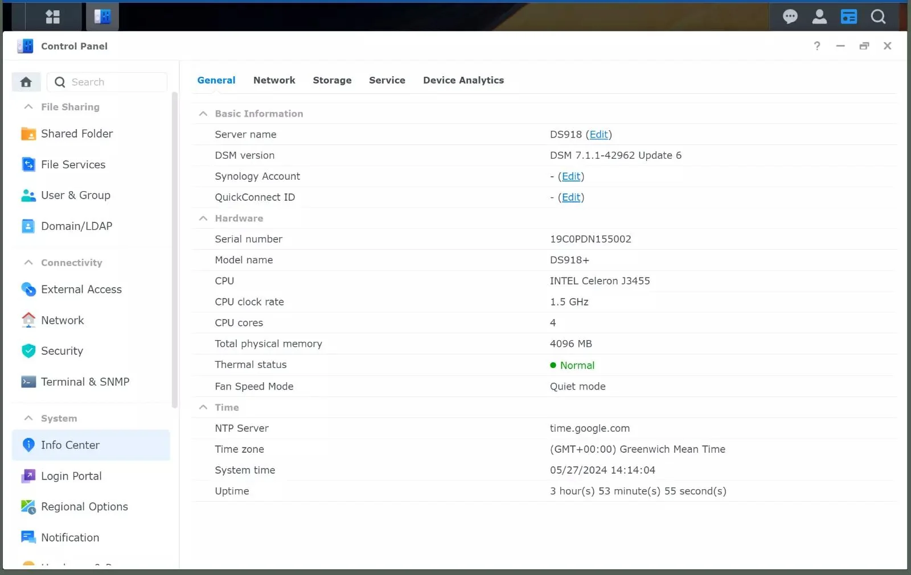

# Compatibility

This page covers DSM version support, CPU architectures, and model compatibility.

## DSM Version Support

SynoCommunity packages support multiple DSM versions:

| DSM Version | Status | Notes |
|-------------|--------|-------|
| DSM 7.2+ | **Full Support** | Latest features, recommended |
| DSM 7.0-7.1 | Supported | Some packages may require 7.1+ |
| DSM 6.2 | Supported | Limited new development |
| DSM 6.0-6.1 | Limited | Legacy support only |
| DSM 5.2 | Minimal | Few packages available |
| SRM 1.2-1.3 | Supported | Router-compatible packages only |

!!! tip "Recommendation"
    For the best experience, run the latest DSM version supported by your NAS model.

## CPU Architectures

Synology NAS devices use different CPU architectures. Packages are built for each supported architecture.

### Current Architectures (DSM 7.x)

| Architecture | CPU Type | Example Models |
|--------------|----------|----------------|
| `x64` | Intel 64-bit | DS923+, DS1823xs+, RS1221+ |
| `armv8` | ARM 64-bit (Realtek RTD) | DS223, DS423, RS422+ |
| `aarch64` | ARM 64-bit (Marvell) | DS220+, DS720+, DS920+ |

### Legacy Architectures (DSM 6.x)

| Architecture | CPU Type | Example Models |
|--------------|----------|----------------|
| `x86` | Intel 32-bit | DS216play, DS116 |
| `armv7` | ARM 32-bit (various) | DS218j, DS418 |
| `qoriq` | Freescale QorIQ | DS215j, RS214 |
| `comcerto2k` | Mindspeed Comcerto | DS414j |
| `ppc853x` | PowerPC | DS109j, DS209 |

!!! note "Legacy Support"
    Legacy architectures receive security updates but limited new package development.

## Finding Your Architecture

### Method 1: DSM Control Panel

1. Log into DSM
2. Go to **Control Panel** > **Info Center** > **General**
3. Note the **Model Name**
4. Look up your model at [Synology's CPU guide](https://kb.synology.com/en-us/DSM/tutorial/What_kind_of_CPU_does_my_NAS_have) to find the architecture

<!-- IMAGE: Screenshot of Control Panel > Info Center showing Model Name -->


### Method 2: SSH

```bash
uname -m
```

Or to get the spksrc architecture name:

```bash
cat /proc/syno_cpu_arch
```

### Method 3: Package Download Page

When browsing packages in **Package Center** on your NAS, it automatically shows only packages compatible with your architecture.

## Model to Architecture Mapping

### Plus Series (Performance)

| Model | Architecture | DSM Support |
|-------|--------------|-------------|
| DS224+ | aarch64 | 7.x |
| DS423+ | aarch64 | 7.x |
| DS723+ | aarch64 | 7.x |
| DS923+ | x64 | 7.x |
| DS1522+ | x64 | 7.x |
| DS1823xs+ | x64 | 7.x |
| DS220+ | aarch64 | 7.x |
| DS720+ | aarch64 | 7.x |
| DS920+ | aarch64 | 7.x |
| DS1520+ | aarch64 | 7.x |

### Value Series

| Model | Architecture | DSM Support |
|-------|--------------|-------------|
| DS223 | armv8 | 7.x |
| DS423 | armv8 | 7.x |
| DS224 | armv8 | 7.x |
| DS218 | armv8 | 6.x-7.x |
| DS418 | armv8 | 6.x-7.x |

### J Series (Budget)

| Model | Architecture | DSM Support |
|-------|--------------|-------------|
| DS223j | armv8 | 7.x |
| DS220j | armv8 | 7.x |
| DS218j | armv7 | 6.x-7.x |
| DS216j | armv7 | 6.x |

### RackStation

| Model | Architecture | DSM Support |
|-------|--------------|-------------|
| RS1221+ | x64 | 7.x |
| RS422+ | armv8 | 7.x |
| RS1619xs+ | x64 | 7.x |
| RS3618xs | x64 | 7.x |

!!! info "Complete List"
    For a complete list of all models and architectures, see [Synology's CPU guide](https://kb.synology.com/en-us/DSM/tutorial/What_kind_of_CPU_does_my_NAS_have).

## Package Availability by Architecture

Not all packages are available for all architectures. Reasons include:

- **Binary dependencies**: Some software only supports certain CPUs
- **Performance requirements**: Some packages need minimum CPU/RAM
- **Toolchain limitations**: Cross-compilation may not support older platforms

Package availability is shown on the package download page and in Package Center.

## DSM Version Requirements

Some packages have minimum DSM version requirements:

| Requirement | Examples | Reason |
|-------------|----------|--------|
| DSM 7.0+ | Most new packages | Uses DSM 7 package format |
| DSM 7.2+ | WebStation packages | PHP 8.x, new web server |
| DSM 6.2.4+ | Older hybrid packages | Final DSM 6 features |

## Checking Compatibility Before Install

The easiest way to check compatibility is to browse packages directly in **Package Center** on your NAS - it only shows packages compatible with your model and DSM version.

You can also browse available packages at [synocommunity.com/packages](https://synocommunity.com/packages).

For more information on installing packages, see [Synology's Package Center guide](https://kb.synology.com/en-us/DSM/tutorial/How_to_install_applications_with_Package_Center).
