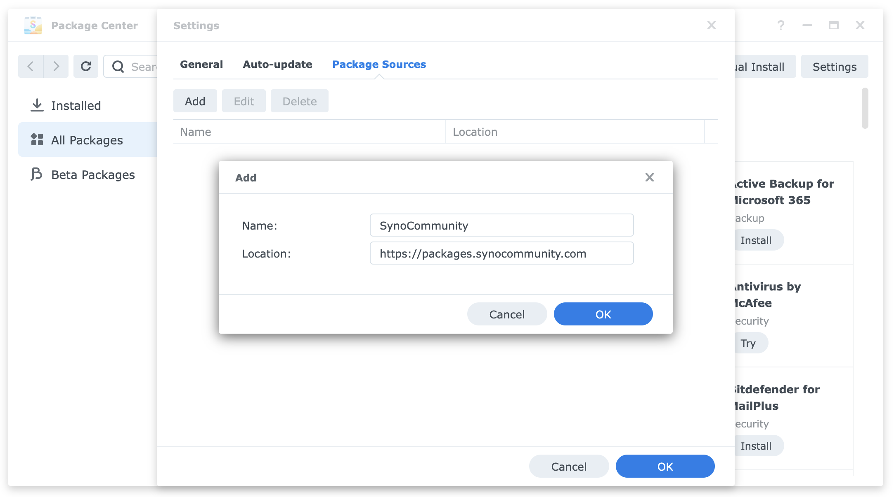
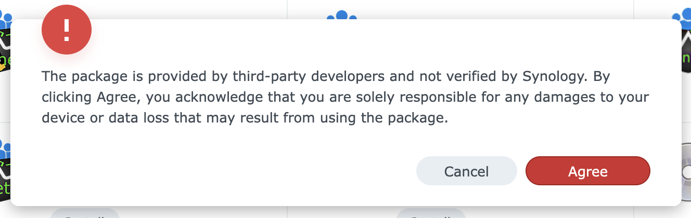
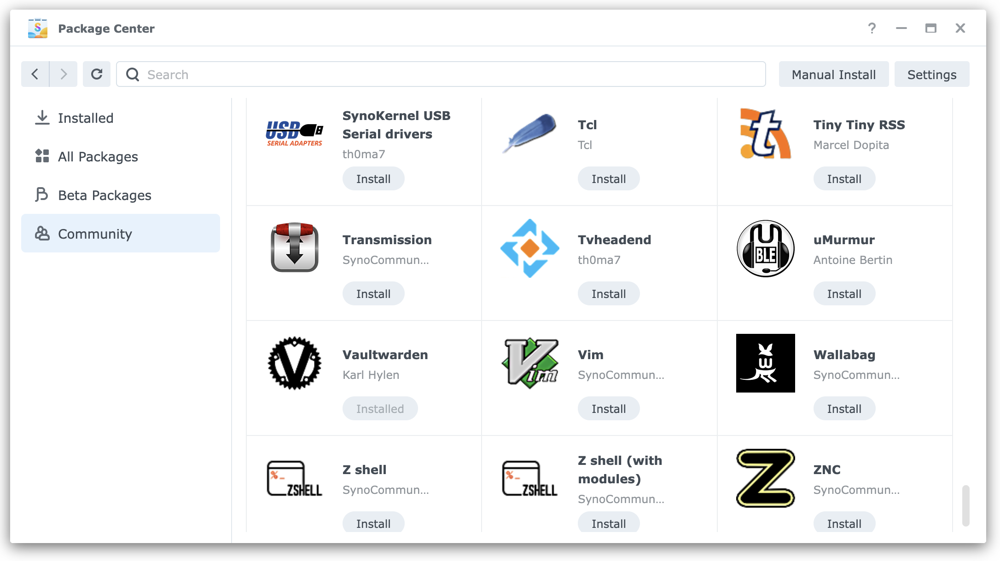

# Installation

This guide covers how to add the SynoCommunity package repository to your Synology NAS and install packages.

## Prerequisites

- A Synology NAS running DSM 5.2 or later
- Administrator access to your NAS
- An internet connection

## Adding the SynoCommunity Repository

### Step 1: Open Package Center

Log into your Synology DSM web interface and click on **Package Center** in the main menu.

### Step 2: Go to Settings

Click the **Settings** button in the top-right corner of Package Center.

### Step 3: Add Package Source

1. Select the **Package Sources** tab
2. Click **Add**
3. Enter the following information:
   - **Name**: `SynoCommunity`
   - **Location**: `https://packages.synocommunity.com`
4. Click **OK**

<!-- IMAGE: Screenshot of Package Center Settings > Package Sources dialog showing
     the Add Source form with Name: SynoCommunity and Location: https://packages.synocommunity.com -->

### Step 4: Trust the Repository (DSM 6.x only)

On DSM 6.x, you may need to adjust trust settings to allow community packages:

1. Go to **Settings** > **General**
2. Set "Trust Level" to **Synology Inc. and trusted publishers**
3. Click **OK**

!!! note "DSM 7.x Users"
    On DSM 7.x, you cannot trust publishers other than Synology. When installing community packages, you will always see a warning that "The package is provided by third-party developers and not verified by Synology". This is expected behavior.

<!-- IMAGE: Screenshot of DSM 7.x third-party package warning dialog -->

## Installing Packages

### From Package Center

1. In Package Center, click **Community** in the left sidebar
2. Browse available packages or use the search box
3. Click on a package to view details
4. Click **Install**

<!-- IMAGE: Screenshot of Package Center showing Community section with package list -->

### Beta Packages

Some packages are available as beta releases for testing. Note that beta packages are only supported on DSM 6.x:

1. Go to **Settings** > **General**
2. Under "Beta", select "Yes, I want to see beta versions"
3. Click **OK**

Beta packages will now appear alongside stable releases. DSM 7.x does not recognize community beta packages.

## Manual Installation

If you cannot add the repository (e.g., restricted network), you can install packages manually:

1. Download the `.spk` file for your architecture from [synocommunity.com](https://synocommunity.com/)
2. In Package Center, click **Manual Install**
3. Browse to select the downloaded `.spk` file
4. Click **Next** and follow the installation wizard

!!! tip "Finding Your Architecture"
    See the [Compatibility](compatibility.md) page to determine your NAS architecture.

## Updating Packages

Packages installed from SynoCommunity receive updates through Package Center:

1. Open Package Center
2. If updates are available, you will see a notification
3. Click **Update** on individual packages, or **Update All**

## Removing Packages

1. Open Package Center
2. Click **Installed** in the left sidebar
3. Find the package you want to remove
4. Click on the package, then click **Uninstall**

!!! note "Data Retention (DSM 7.x only)"
    On DSM 7.x, uninstalling a package keeps its data by default. To remove all data, check the "Delete the data..." option during uninstall. On DSM 6.x, most packages remove all associated data by default, so manually back up any data you want to retain before uninstalling.

## Troubleshooting

If you encounter issues adding the repository or installing packages:

- Check your internet connection
- Verify the repository URL is correct
- See the [Troubleshooting](troubleshooting.md) guide for common issues
- Check the [GitHub issues](https://github.com/SynoCommunity/spksrc/issues) for known problems
